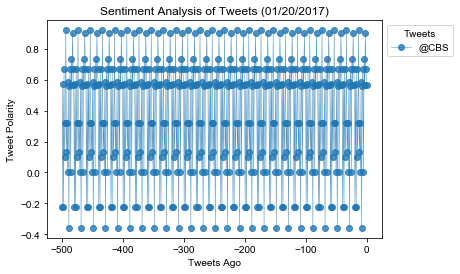

```python
import pandas as pd
import json
import tweepy
import matplotlib.pyplot as plt
import seaborn as sns
from vaderSentiment.vaderSentiment import SentimentIntensityAnalyzer
import numpy as np
import time
import random
```


```python
# Import and Initialize Sentiment Analyzer
from vaderSentiment.vaderSentiment import SentimentIntensityAnalyzer
analyzer = SentimentIntensityAnalyzer()
```


```python
# Twitter API Keys
consumer_key = "zceXcm7pek1G8ZZTmPQmGL7uS"
consumer_secret = "djqcMgQKoKTirS617FmKvC6rKzMeE34Rv3ODVfB7rk7QmyWohY"
access_token = "548324819-njxGy0Hihw2XtZmL0cyTDD5WeqPwi8OTQY3P9aZy"
access_token_secret = "9ZRSepDKzo16yNvan4zHfMuCkq3aDCC6f0I063caSQT4S"
```


```python
# Setup Tweepy API Authentication
auth = tweepy.OAuthHandler(consumer_key, consumer_secret)
auth.set_access_token(access_token, access_token_secret)
api = tweepy.API(auth)
```


```python
# tweet out
command_quotes = ["@PlotBot Analyze: @BBC",
                  "@PlotBot Analyze: @CNN",
                  "@PlotBot Analyze: @CBS"]
for x in range(3):
    api.update_status(command_quotes[x])
    time.sleep(5)
```


```python
def sentiment():
    target = "@harryiswang"
    target_tweets = tweepy.Cursor(api.user_timeline, id=target).items(1)
    for t_tweet in target_tweets:
        if t_tweet.text[:17] == "@PlotBot Analyze:":
            # scan your account every five minutes for mentions
            target_user = t_tweet.text[18:]

            # Counter
            counter = 0

            # Variables for holding sentiments
            sentiments = []

            # Loop through 25 pages of tweets (total 500 tweets)
            for x in range(25):

                # Get all tweets from home feed
                public_tweets = api.user_timeline(target_user)
    
                # Loop through all tweets 
                for tweet in public_tweets:
        
                    # Run Vader Analysis on each tweet
                    compound = analyzer.polarity_scores(tweet.text)["compound"]
                    pos = analyzer.polarity_scores(tweet.text)["pos"]
                    neu = analyzer.polarity_scores(tweet.text)["neu"]
                    neg = analyzer.polarity_scores(tweet.text)["neg"]
                    tweets_ago = counter
            
                    # Add sentiments for each tweet into an array
                    sentiments.append({"Date": tweet.created_at, 
                                       "Compound": compound,
                                       "Positive": pos,
                                       "Negative": neu,
                                       "Neutral": neg,
                                       "Tweets Ago": counter})
        
                    # Add to counter 
                    counter = counter - 1
            sentiments_pd = pd.DataFrame.from_dict(sentiments)
        # Create plot
            plt.plot(sentiments_pd["Tweets Ago"],sentiments_pd["Compound"], 
                 marker="o", linewidth=0.5, alpha=0.8, label=t_tweet.text[18:])
        # Incorporate the other graph properties
            plt.title("Sentiment Analysis of Tweets (01/20/2017)")
            plt.ylabel("Tweet Polarity")
            plt.xlabel("Tweets Ago")
            plt.legend(bbox_to_anchor=(1,1),loc=2,title='Tweets',fontsize=10)
            sns.set()
            plt.savefig("PlotBot.png")
            plt.show()
            api.update_with_media("PlotBot.png", "New Tweet Analysis:" + t_tweet.text[18:] + "(Thx" + target + "!!)")
    return 
```


```python
while(True):
    sentiment()
    time.sleep(300)
```





```python
# Create plot
plt.plot(sentiments_pd["Tweets Ago"],
         sentiments_pd["Compound"], marker="o", linewidth=0.5,
         alpha=0.8,label=tweet.text[18:])

# # Incorporate the other graph properties
plt.title("Sentiment Analysis of Tweets (01/20/2017)")
plt.ylabel("Tweet Polarity")
plt.xlabel("Tweets Ago")
plt.legend(bbox_to_anchor=(1,1),loc=2,title='Tweets',fontsize=10)
sns.set()
plt.savefig("111.jpg")
plt.show()
```
